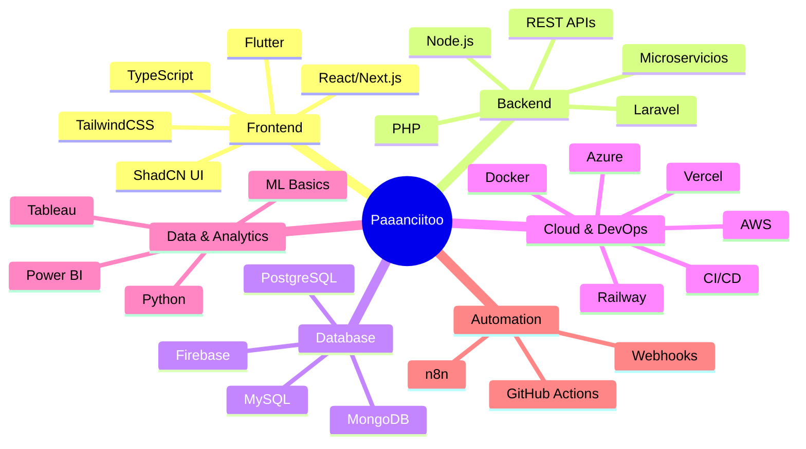

<div align="center">

# ¡Hola! 👋 Soy **Paaanciitoo**

[](https://git.io/typing-svg)

**Desarrollador Full-Stack · Front-End · Mobile · UX/UI**  
📍 Talca, Chile

*Enfocado en soluciones limpias, escalables y con excelente experiencia de usuario*

[](https://linkedin.com/in/nicolasmachuca687)
[](mailto:nmachuca86@gmail.com)
[](https://wa.me/56972939147)


</div>

---

## 🚀 Sobre Mí

Ingeniero en Informática con experiencia en desarrollo **Full-Stack** y **Mobile**. Me especializo en construir productos digitales con arquitectura sólida, APIs limpias, frontends rápidos y apps móviles pulidas. Actualmente trabajo en **Bee Fractal** como Front-End Developer y como Full-Stack Developer freelance en **Brouter SPA**.

```typescript
const paaanciitoo = {
    nombre: "Nicolás Machuca Pavez",
    ubicación: "📍 Talca, Chile",
    empresa: ["Bee Fractal", "Brouter SPA (Freelance)"],
    roles: ["Full-Stack Developer", "Front-End Developer", "Mobile Developer"],
    especialización: [
        "Arquitecturas Escalables",
        "Optimización de Rendimiento", 
        "UX/UI Design",
        "Cloud & DevOps"
    ],
    logrosDestacados: {
        rendimiento: "↓ 30% en tiempos de carga",
        automatización: "↓ 40% en procesos manuales",
        retención: "↑ 20% con mejoras UX/UI",
        desarrollo: "↑ 30% en velocidad con arquitecturas modulares"
    },
    filosofía: "Código limpio, modular y testeable con UX primero",
    disponible: true,
    idiomas: ["Español (Nativo)", "Inglés (C1)"]
};
```

---

## 💼 Experiencia Profesional

### 🔷 **Bee Fractal** — Desarrollador Front-End
**Marzo 2025 - Actualidad** · Talca, Chile

- ⚡ Desarrollo de interfaces dinámicas con **Laravel**, **React** y **n8n**, logrando **40% de reducción** en procesos manuales mediante automatización
- 📱 Diseño e implementación de aplicaciones móviles con **Flutter**, aumentando la retención de usuarios en **20%** gracias a mejoras significativas de UX/UI
- 🚀 Optimización del rendimiento de arquitectura de software aplicando técnicas de lazy loading y caching, disminuyendo tiempos de carga en **25%**
- 🔄 Implementación de metodologías ágiles (**Scrum**) para mejorar la entrega continua y calidad de proyectos

### 🔶 **Brouter SPA** — Desarrollador Full-Stack (Freelance)
**Enero 2025 - Actualidad** · Talca, Chile

- 🏗️ Desarrollo de soluciones completas con **Laravel**, **React** y bases de datos **SQL**, mejorando la velocidad de desarrollo en **30%** mediante arquitecturas modulares y reutilizables
- 💳 Integración de sistemas de ecommerce con pasarelas de pago (Webpay, Flow, Mercado Pago) y sistemas de QR, optimizando la conversión de usuarios
- 📊 Diseño y desarrollo de dashboards administrativos y sistemas de reservas con visualizaciones interactivas
- ☁️ Gestión de despliegues en **Vercel** y **Railway** con pipelines automatizados de CI/CD

### 💻 **Proyectos Personales** — Desarrollador Full-Stack
**Enero 2022 - Actualidad** · Talca, Chile

- 🎯 Desarrollo de aplicaciones con **Next.js**, **TailwindCSS** y **Firebase**, optimizando el rendimiento en **30%** mediante SSR/SSG y code splitting
- 🔐 Implementación de sistemas de autenticación (JWT, OAuth), notificaciones en tiempo real con WebSockets y prototipos con lógica de negocio real
- 📚 Documentación completa de proyectos en **GitHub** con código limpio y aplicación de principios SOLID

---

## 🛠️ Stack Tecnológico

<div align="center">

### Frontend Development


### Backend Development


### Mobile Development


### Bases de Datos


### Cloud & DevOps


### Data & Analytics


### Herramientas & Otros


</div>

---

## 📊 Estadísticas de GitHub

<div align="center">


</div>

---

## 🏆 Métricas de Impacto

<div align="center">

| 🎯 Optimización | ⚡ Automatización | 📱 UX/UI | 🚀 Desarrollo |
|:---:|:---:|:---:|:---:|
| **↓ 30%** tiempos de carga | **↓ 40%** procesos manuales | **↑ 20%** retención usuarios | **↑ 30%** velocidad desarrollo |
| SSR/SSG + Lazy Loading | n8n + Integraciones | Flutter + Design Systems | Arquitecturas modulares |

</div>

---

## 🎯 Áreas de Especialización



---

## 🎓 Formación Académica

### 🎓 **Ingeniería en Informática** — INACAP
**2023 - 2025** · Titulado
- 🥇 **Primer lugar** en el ranking académico
- Especialización en desarrollo de software y arquitecturas escalables

### 🎓 **Técnico Superior en Análisis de Sistemas** — INACAP
**2021 - 2022** · Titulado
- Fundamentos de análisis, diseño y programación de sistemas

---

## 💡 Proyectos Destacados

### 🔸 **Sistemas de Ecommerce Completos**
```yaml
Tecnologías: Laravel, React, PostgreSQL, Stripe
Características:
  - Integración con pasarelas de pago (Webpay, Flow, Mercado Pago)
  - Sistema de gestión de inventario en tiempo real
  - Pagos con QR y códigos de descuento
  - Dashboard administrativo con métricas de conversión
  - Optimización de checkout (reducción de abandono)
```

### 🔸 **Dashboards Administrativos Interactivos**
```yaml
Tecnologías: Next.js, TailwindCSS, Recharts, PostgreSQL
Características:
  - Visualización de KPIs en tiempo real
  - Sistemas de reservas y agendamiento
  - Reportes exportables (PDF, Excel)
  - Gestión de usuarios con roles y permisos
  - Notificaciones push y por email
```

### 🔸 **Aplicaciones Móviles Multiplataforma**
```yaml
Tecnologías: Flutter, Firebase, REST APIs
Características:
  - Diseño UX/UI centrado en el usuario
  - Autenticación biométrica
  - Sincronización offline-first
  - Push notifications
  - Analytics integrado
```

### 🔸 **Automatizaciones con n8n**
```yaml
Tecnologías: n8n, Webhooks, APIs REST
Características:
  - Integración entre múltiples plataformas
  - Automatización de tareas repetitivas
  - Notificaciones automáticas
  - Sincronización de datos entre sistemas
  - Reducción del 40% en procesos manuales
```

---

## 🧩 Filosofía de Desarrollo

<div align="center">

> *"El código limpio no se escribe siguiendo un conjunto de reglas.*  
> *El profesionalismo y la artesanía provienen de los valores que impulsan la disciplina."*  
> **— Robert C. Martin**

</div>

### ✨ Mis Principios

- **💎 Código Limpio**: Priorizando legibilidad, mantenibilidad y principios SOLID
- **🎯 UX Primero**: Decisiones de producto guiadas por las necesidades del usuario
- **⚡ Performance**: Optimización constante del rendimiento y tiempos de carga
- **🏗️ Arquitectura Escalable**: Diseños modulares que crecen con el negocio
- **📊 Data-Driven**: Entregas iterativas medibles con métricas claras
- **📝 Documentación**: Código autodocumentado y documentación técnica al día
- **🔄 Mejora Continua**: Aprendizaje constante de nuevas tecnologías y mejores prácticas
- **🤝 Comunicación Clara**: Trabajo en equipo efectivo y feedback constructivo

---

## 🏅 Logros Destacados

<div align="center">

| 🥇 Académico | 🚀 Técnico | 💼 Profesional | 🎯 Impacto |
|:---:|:---:|:---:|:---:|
| Primer lugar ranking INACAP | Pipelines CI/CD automatizados | Mentoría en buenas prácticas | Reducción 25-30% tiempos carga |
| Titulación con honores | Dashboards con KPIs interactivos | GitFlow & Code Reviews | Mejora 20% retención usuarios |
| 2 títulos profesionales | Arquitecturas microservicios | Metodologías ágiles (Scrum) | Automatización 40% procesos |

</div>

---

## 🌐 Idiomas

<div align="center">


-0A84FF?style=for-the-badge)

</div>

---

## 🤝 Disponible Para

<div align="center">

| 💼 | 🤝 | 🎓 | 💡 |
|:---:|:---:|:---:|:---:|
| **Proyectos Freelance** | **Colaboraciones Open Source** | **Mentoría & Code Reviews** | **Consultoría Técnica** |
| Desarrollo Full-Stack | Contribuciones a proyectos | Revisión de código | Arquitectura de software |
| Apps Web y Móviles | Pair programming | Mejores prácticas | Optimización de rendimiento |

</div>

---

## 📫 Contacto

<div align="center">

### ¿Quieres colaborar en un proyecto o necesitas una consultoría?

[](https://linkedin.com/in/nicolasmachuca687)
[](mailto:nmachuca86@gmail.com)
[](https://wa.me/56972939147)

### 📍 Ubicación: Talca, Chile

</div>

---

<div align="center">

### 💻 *"Construyendo el futuro digital, una línea de código a la vez"*


**⭐️ Si te gusta mi trabajo, no dudes en darle una estrella a mis repositorios**

---

**Made with ❤️ by Paaanciitoo**

</div>
